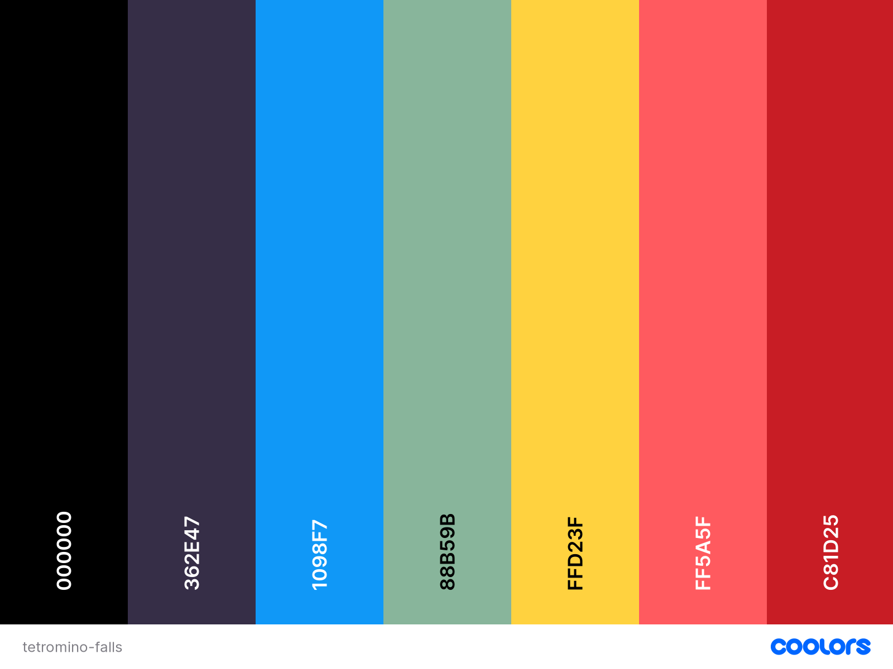
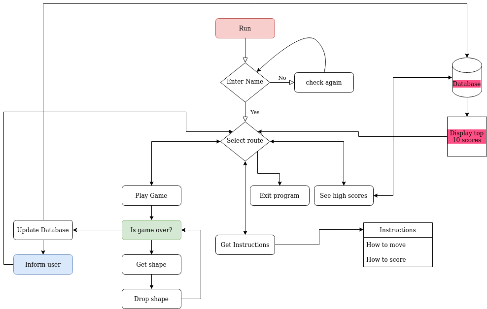

# Tetromino Falls

Developer: Kristian Colville

[Visit Tetromino Falls](https://tetromino-falls.herokuapp.com/)

(Image of final terminal)

## Table of Contents
* [Project Goals](#project-goals)
    * [User Goals](#user-goals)
    * [Site Owners Goals](#site-owners-goals)
* [User Experience](#user-experience-ux)
    * [Target Audience](#target-audience)
    * [User Requirements and Expectations](#user-requirements-and-expectations)
* [User Stories](#user-stories)
    * [Site User](#site-user)
    * [Site Owner](#site-owner)
* [Design](#design)
    * [Color Scheme](#color-scheme)
    * [Fonts](#color-scheme)
    * [Structure](#color-scheme)
    * [Wireframes](#wireframes)
* [Technologies & Tools](#technologies--tools)
    * [Main Tech](#main-tech)
    * [Python Packages Used](#python-packages-used)
* [Logic](#logic)
    * [Initial Flow](#initial-flow)
    * [Python Logic](#python-logic)
* [Features](#features)
* [Data Model](#data-model)
* [Validation](#validation)
    * [HTML Validation](#html-validation)
    * [CSS Validation](#css-validation)
    * [JavaScript Validation](#javascript-validation)
    * [LightHouse](#lighthouse)
* [Testing](#testing)
    * [Python Testing](#python-testing)
        * [PEP8 Testing](#pep8-testing)
        * [Linters](#Linters)
    * [Testing User Stories](#testing-user-stories)
* [Bugs](#bugs)
* [Deployment](#deployment)
    * [Version Control](#version-control)
    * [Heroku](#heroku)
    * [Cloning this Repository](#cloning-this-repository)
    * [Local Machine](#local-machine)
* [Credits](#credits)
* [Acknowledgements](#acknowledgements)

## Project Goals
The goals of this project include:
- Designing an interactive game that takes advantage of a [command line interface](https://en.wikipedia.org/wiki/Command-line_interface).
- It should be highly attractive and visually pleasing to the user of the terminal game. 
- The game is expected to run within a terminal so should be built to take advantage of this scenario.
- The project should be deployed to Heroku.
- The expectation is that the [python language](https://en.wikipedia.org/wiki/Python_(programming_language)) is used throughout.

### User Goals

- To play a terminal based game that is fun and easy to use
- Be able to interact with the game in real time and not stall while waiting for input
### Site Owners Goals

- Create a game that is fun and easy for the user to understand
- Make the terminal game visually attractive to users
- Circumvent waiting for user input within the terminal
- Create the game using python

[Back to Top](#table-of-contents)
## User Experience (UX)
### Target Audience

- This game can be played by anyone who enjoys puzzle-based games
- Any user who likes interactive games
- Any user that enjoys a challenge with easy to understand rules.
### User Requirements and Expectations

- Game rules that are easy to understand
- Clear navigation through the terminal game
- Any errors or actions are handled and work as expected
- The game can update the database for users and scores
- There is feedback given where appropriate
- The user is not expected to constantly enter input to the play the game
- The user can find any relevant information they need
- The game should be family friendly and avoid profanity

[Back to Top](#table-of-contents)
## User Stories
### Site User

1. I want to understand the rules of the game
2. I want to have the ability to see my name in the terminal
3. I want the game to play and not wait for my input
4. I want the ability to rotate shapes so I can be strategical 
5. I want to know how long the game takes to solve
6. I want to see my current score
7. I want to see my name and score in the top results if I score high
8. I want the ability to see my next shape so I can be strategical
9. I want to see shapes in different colors
10. I want the terminal game to be visually pleasing

### Site Owner

11. I want to see no profanity in the scores or terminal
12. I want the user to understand the game rules easily
13. I want the user of the terminal game to not have to constantly enter input
14. I want the user to be able to update the database with there score
16. I want the user to be able to see the top scores
17. I want my terminal game to have different shapes and colors for the game pieces
18. I want my terminal game to be interactive
19. Any known errors should be handled and feedback should be provided to the user
20. If any errors occur the user should be able to navigate to the desired area in the terminal

[Back to Top](#table-of-contents)
## Design
### Color Scheme

Although not a requirement for this project some CSS was implemented.
I chose to make the title for the website an animation fading through 7 colors.

The colors of the terminal shapes were limited by the capabilities of the curses module.
The colors inside the terminal for your local machine could look different to the ones displayed in Tetromino Falls terminal.

The colors used inside the terminal:

- blue
- cyan
- red
- yellow
- green
- purple
- white

Color palette used in HTML & CSS:

### Fonts
As mentioned above some CSS was implemented. I chose to use [Google Fonts](https://fonts.google.com/) for some HTML within the website. The font I used was [Press Start 2P](https://fonts.google.com/specimen/Press+Start+2P). This font helped add some cohesive style to project for viewing in a web page.

### Structure
### Wireframes
[Back to Top](#table-of-contents)
## Technologies & Tools
### Main Tech
### Python Packages Used
[Back to Top](#table-of-contents)
## Logic
### Initial Flow

### Python Logic
[Back to Top](#table-of-contents)
## Features
[Back to Top](#table-of-contents)
## Data Model
[Back to Top](#table-of-contents)
## Validation
### HTML Validation
### CSS Validation
### JavaScript Validation
### LightHouse

[Back to Top](#table-of-contents)
## Testing
### Python Testing
### Testing User Stories

1. I want to understand the rules of the game

| Feature | Action | Expected Result | Actual Result |
| --- | --- | --- | --- |
| 1 | 2 | 3 | 4 |

See Screenshot

2. I want to have the ability to see my name in the terminal

| Feature | Action | Expected Result | Actual Result |
| --- | --- | --- | --- |
| 1 | 2 | 3 | 4 |

See Screenshot

3. I want the game to play and not wait for my input

| Feature | Action | Expected Result | Actual Result |
| --- | --- | --- | --- |
| 1 | 2 | 3 | 4 |

See Screenshot

4. I want the ability to rotate shapes so I can be strategical 

| Feature | Action | Expected Result | Actual Result |
| --- | --- | --- | --- |
| 1 | 2 | 3 | 4 |

See Screenshot

5. I want to know how long the game takes to solve

| Feature | Action | Expected Result | Actual Result |
| --- | --- | --- | --- |
| 1 | 2 | 3 | 4 |

See Screenshot

6. I want to see my current score

| Feature | Action | Expected Result | Actual Result |
| --- | --- | --- | --- |
| 1 | 2 | 3 | 4 |

See Screenshot

7. I want to see my name and score in the top results if I score high

| Feature | Action | Expected Result | Actual Result |
| --- | --- | --- | --- |
| 1 | 2 | 3 | 4 |

See Screenshot

8. I want the ability to see my next shape so I can be strategical

| Feature | Action | Expected Result | Actual Result |
| --- | --- | --- | --- |
| 1 | 2 | 3 | 4 |

See Screenshot

9. I want to see shapes in different colors

| Feature | Action | Expected Result | Actual Result |
| --- | --- | --- | --- |
| 1 | 2 | 3 | 4 |

See Screenshot

10. I want the terminal game to be visually pleasing

| Feature | Action | Expected Result | Actual Result |
| --- | --- | --- | --- |
| 1 | 2 | 3 | 4 |

See Screenshot

11. I want to see no profanity in the scores or terminal

| Feature | Action | Expected Result | Actual Result |
| --- | --- | --- | --- |
| 1 | 2 | 3 | 4 |

See Screenshot

12. I want the user to understand the game rules easily

| Feature | Action | Expected Result | Actual Result |
| --- | --- | --- | --- |
| 1 | 2 | 3 | 4 |

See Screenshot

13. I want the user of the terminal game to not have to constantly enter input

| Feature | Action | Expected Result | Actual Result |
| --- | --- | --- | --- |
| 1 | 2 | 3 | 4 |

See Screenshot

14. I want the user to be able to update the database with there score

| Feature | Action | Expected Result | Actual Result |
| --- | --- | --- | --- |
| 1 | 2 | 3 | 4 |

See Screenshot

16. I want the user to be able to see the top scores

| Feature | Action | Expected Result | Actual Result |
| --- | --- | --- | --- |
| 1 | 2 | 3 | 4 |

See Screenshot

17. I want my terminal game to have different shapes and colors for the game pieces

| Feature | Action | Expected Result | Actual Result |
| --- | --- | --- | --- |
| 1 | 2 | 3 | 4 |

See Screenshot

18. I want my terminal game to be interactive

| Feature | Action | Expected Result | Actual Result |
| --- | --- | --- | --- |
| 1 | 2 | 3 | 4 |

See Screenshot

19. Any known errors should be handled and feedback should be provided to the user

| Feature | Action | Expected Result | Actual Result |
| --- | --- | --- | --- |
| 1 | 2 | 3 | 4 |

See Screenshot

20. If any errors occur the user should be able to navigate to the desired area in the terminal

| Feature | Action | Expected Result | Actual Result |
| --- | --- | --- | --- |
| 1 | 2 | 3 | 4 |

See Screenshot

[Back to Top](#table-of-contents)
## Bugs
| Bug | Fix |
| --- | --- |
| Curses objects interfering with user input | Tried refactoring code blocks and discovered after trying to make a window class that the issue was because the objects were initialized before trying to get user input, I separated the code structure in run.py and this helped|
| Shapes not displaying correctly with when adding shapes to board, they end up just displaying cubes | (in progress) |
| 1 | 2 |
| 1 | 2 |
| 1 | 2 |
| 1 | 2 |
| 1 | 2 |
| 1 | 2 |
| 1 | 2 |

[Back to Top](#table-of-contents)
## Deployment
### Version Control
I used [Visual Studio Code](https://code.visualstudio.com/) as a local repository and IDE & [GitHub](https://github.com/) as a remote repository.

1. Firstly, I needed to create a new repository on Github [tetromino-falls](https://github.com/KristianColville1/tetromino-falls).
2. I opened that repository on my local machine by copying the URL from that repository and cloning it from my IDE for use.
3. Visual Studio Code opened a new workspace for me.
4. I created files and folders to use.
5. To push my newly created files to GitHub I used the terminal by pressing Ctrl + shift + `.
6. A new terminal opened and then I used the below steps.

    - git add (name of the file) *This selects the file for the commit*
    - git commit -m "Commit message: (i.e. Initial commit)" *Allows the developer to assign a specific concise statement to the commit*
    - git push *The final command sends the code to GitHub*

### Heroku
As a deployment solution I chose [Heroku](https://dashboard.heroku.com).

To deploy a project using Heroku follow these steps:

- Log into heroku
- Go to the heroku dashboard
- Create a new app by selecting 'New'
- Give your application a name and select a preferred location
- Click the 'Create app' button
- If you have config variables in your application
    - Click on settings
    - Click 'Reveal config vars'
    - Input your deployment variables

- If you need specific build packs
    - Click on settings
    - Click on build pack
    - Add your packs as needed (Please be aware that the order matters)
    - For Tetromino Falls, Python and then NodeJs was selected.

- Once these steps are completed
    - Go to the deploy section
    - Select your version control system
    - For Tetromino Falls, GitHub was selected

- Connect your version control system
- Add your repository
- Connect the app selecting 'connect'
- Either choose automatic deployment or manual deployment
- Once all these steps are completed and the build is successful
    - You can click the 'view' button
    - It will reveal your deployed app
    
### Cloning this Repository
If you would like to clone this repository please follow the bellow steps.

Instructions:

1. Log into GitHub
2. Navigate to the repository you want to clone
3. Click on the green button labelled 'Code'
4. Copy the URL under the HTTPS option
5. Open an IDE of your choosing that has Git installed
6. Open a new terminal window in your IDE
7. Type this exactly: git clone the-URL-you-copied-from-GitHub
8. Hit Enter

You should have a local copy of the repository to use on your machine.

### Local Machine
I used [Ubuntu](https://ubuntu.com/) as my [operating system](https://en.wikipedia.org/wiki/Operating_system) so I could use the non windows version of the python programming language and access the normal [curses module](https://docs.python.org/3/howto/curses.html#the-python-curses-module).

This decision was made to take advantage of the terminal template provided by [Code Institute](https://codeinstitute.net/ie/) for this project.

Please visit the embedded links above for more information.

To run the game from your local machine:

- Open a new terminal
- Type python3 run.py

If you have python correctly installed and the necessary packages the game should run in your terminal.

[Back to Top](#table-of-contents)
## Credits

Ternary operator for clearing the console if an error occurs taken from [Delf Stack](https://www.delftstack.com/howto/python/python-clear-console/).

[Back to Top](#table-of-contents)
## Acknowledgements
[Back to Top](#table-of-contents)